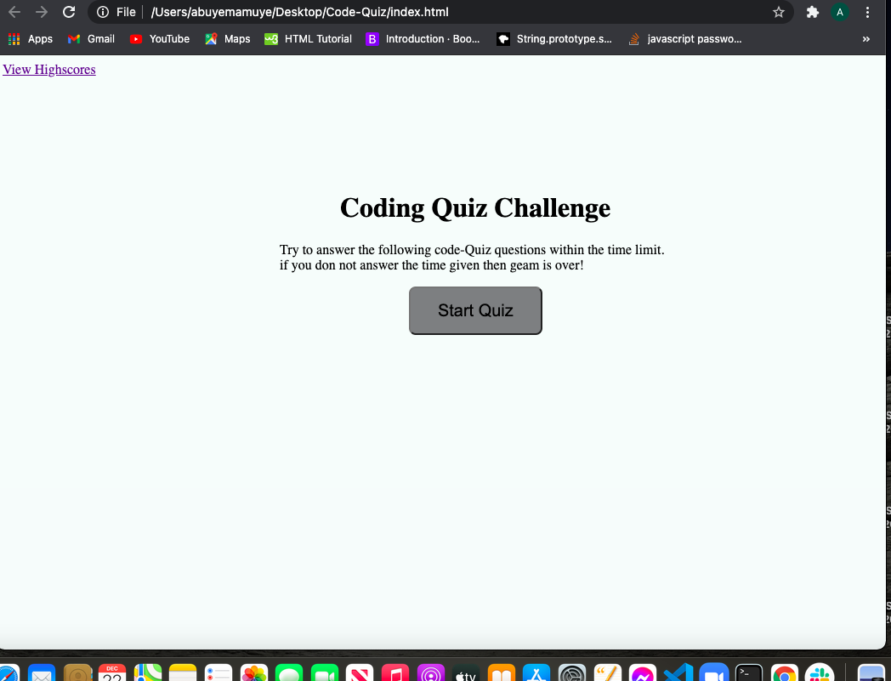
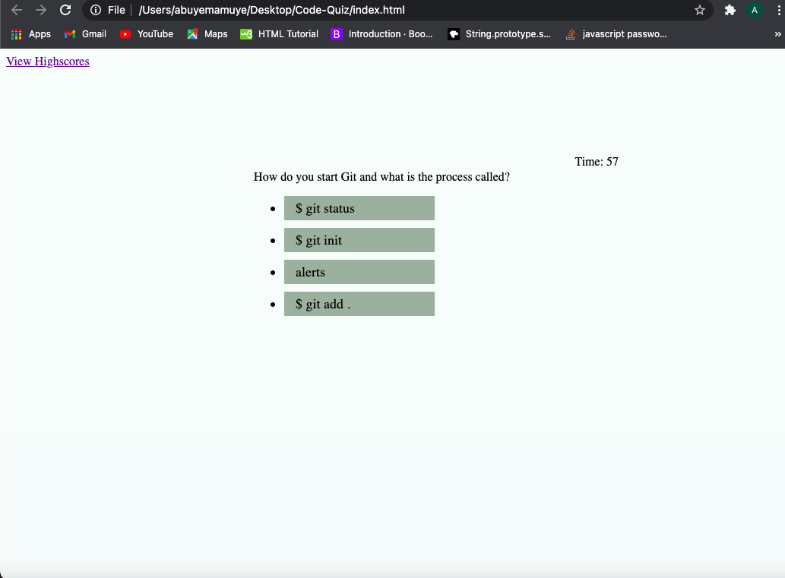
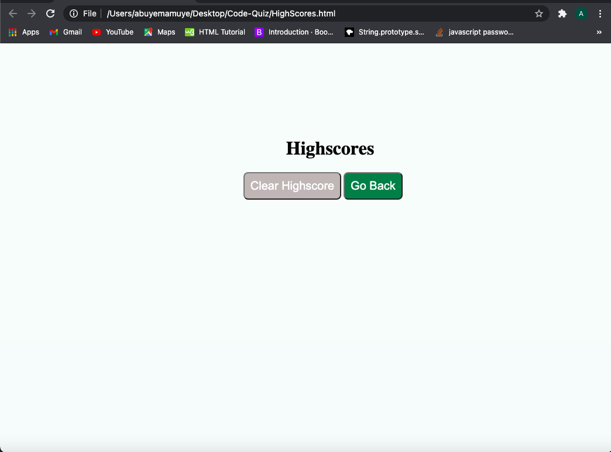
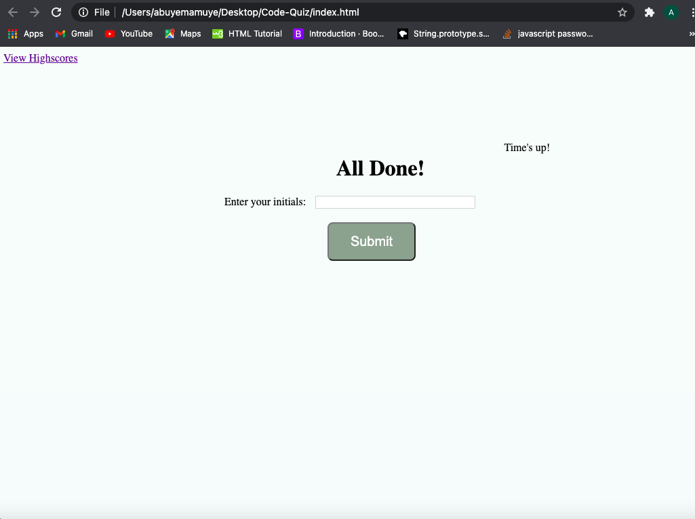

# Web APIs: Code Quiz

## Table of Contents

- [Description](#description)

- [Images](#images)

- [CodeSnippets](#CodeSnippets)

- [Deployed Link](#deployed-link)

- [TechnonlogyUse](#Technonlogy-Use)

- [License](#license)

- [Question](#Question)

- [Acknowledgments](#Acknowledgments)

## Description

This is a quiz application using HTML,CSS and Javascript.
this application focus on the javascript to provide quiz questions and
collect user data decide whether the answers correct or wrong.
also this applicatio has a score and results.

## Images

## CodeSnippets

## HTML

    

        <!-- Div for timer -->
        

        <!-- Div for quiz content -->
        

            <h1>Coding Quiz Challenge</h1>
            
Try to answer the following code-Quiz questions within the time limit. if you don not answer the time given then geam is over!

            <ul id="choicesUl"></ul>
            <!-- Buttons -->
            <button id="startTime">Start Quiz</button>
        

## Javascript

    // Declared variables
     var score = 0;
    var questionIndex = 0;

    // Start working code
    // Declared variables
    var currentTime = document.querySelector("#currentTime");
    var timer = document.querySelector("#startTime");
    var questionsDiv = document.querySelector("#questionsDiv");
    var wrapper = document.querySelector("#wrapper");

    // Seconds left is 15 seconds per question:
    var secondsLeft = 75;
    // Holds interval time
    var holdInterval = 0;
    // Holds penalty time
    var penalty = 10;
    // Creates new element
    var ulCreate = document.createElement("ul");

## Deployed Link

- https://abuyem1.github.io/Password-Generator/

## Technonlogy-Use

- HTML
- CSS
- Javascript

## License

## Question

- [Email](abuye20@yahoo.com)

- [GitHub](https://github.com/AbuyeM1)

- [LinkedIn](https://www.linkedin.com/in/abuye-mamuye-5a49921b0/)

## Acknowledgments

- Jerome Chenette (Instructor)
- Manuel Nunes (TA)
- Mahisha Manikandan (TA)
- UC Berkeley Coding Bootcamp
